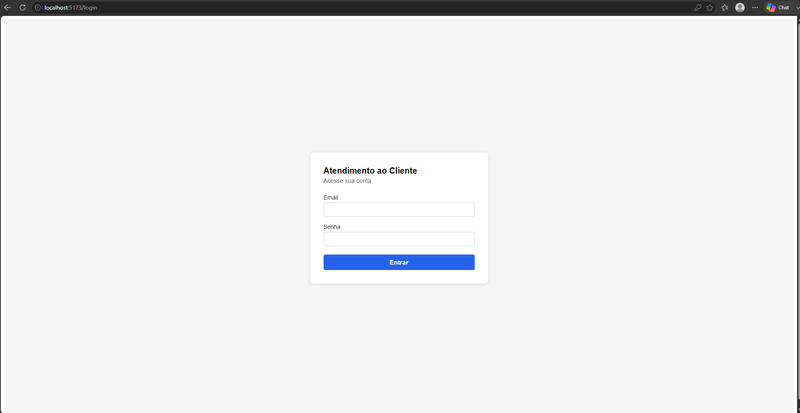
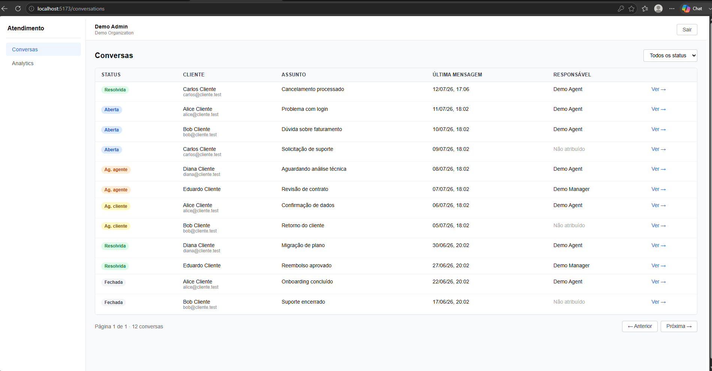
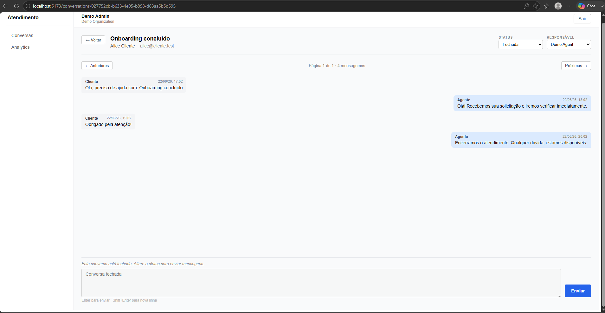
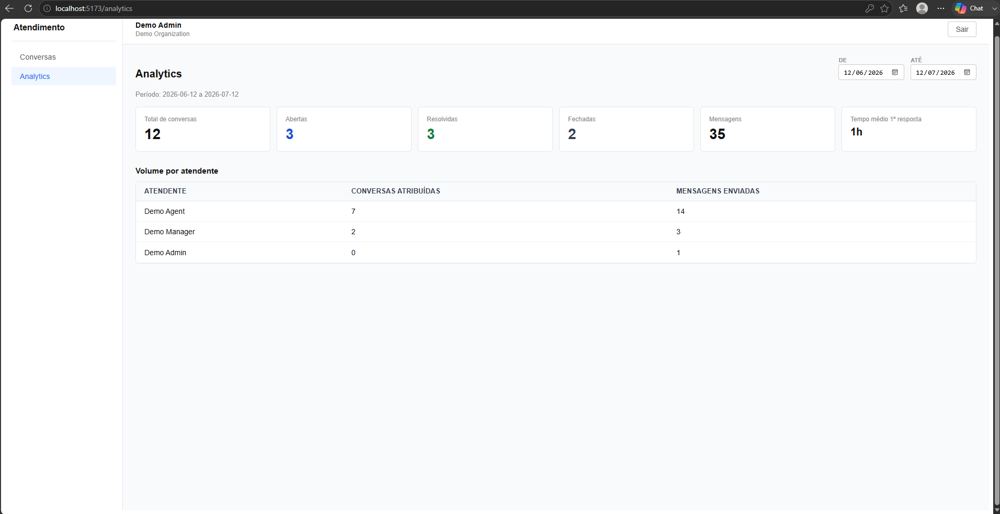

<!-- Projeto Desenvolvido na Data Science Academy -->

# Projeto 1 - Construindo Um SaaS de Atendimento ao Cliente

Este repositório organiza o projeto **SaaS de Atendimento ao Cliente** (sem IA/RAG; foco em backend, API e dashboard).

O projeto é full stack, mas a ênfase operacional está no backend e no uso de **Spec-Driven Development** para conduzir programação assistida por IA com Claude Code ou outro assistente.

## Stack técnica

**Backend** (`apps/api`):

| Camada | Tecnologia |
|---|---|
| Runtime | Node.js 22 |
| Framework HTTP | Fastify 5 + TypeScript 5 (strict) |
| Validação | Zod 4 |
| ORM / Banco | Prisma 6 + PostgreSQL 16 |
| Cache / Rate limit | Redis 7 (`ioredis`) |
| Autenticação | `@fastify/jwt`, `bcryptjs` (hash de senha) |
| Testes | Vitest 3 (118 testes) |
| Lint | ESLint 9 + `typescript-eslint` |

**Frontend** (`apps/web`):

| Camada | Tecnologia |
|---|---|
| Framework | React 19 + Vite 7 + TypeScript 5 |
| Roteamento | React Router 7 |
| Testes | Vitest 3 + Testing Library (17 testes) |
| Lint | ESLint 9 + `typescript-eslint` + `eslint-plugin-react-hooks` |

## Arquitetura

### Multi-tenancy e autorização

Toda entidade de domínio (`Conversation`, `Message`, `Customer`, `OrganizationMember`) carrega `organizationId`; todas as queries do backend filtram por ele — o isolamento entre organizações nunca depende do frontend.

Autorização é RBAC por papel, aplicada via guard `requirePermission` nas rotas sensíveis:

| Papel | Permissões |
|---|---|
| `owner` | todas |
| `admin` | `users.read/manage`, `conversations.read/create/manage`, `messages.create`, `analytics.read` |
| `manager` | `users.read`, `conversations.read/manage`, `messages.create`, `analytics.read` |
| `agent` | `users.read`, `conversations.read/create/manage`, `messages.create` |
| `viewer` | `conversations.read`, `analytics.read` |

Detalhes em [`authorization-spec.md`](docs/sdd/specs/authorization-spec.md).

### Modelo de domínio

`Organization` → `OrganizationMember` (papel + status) → `User`; `Conversation` pertence a `Organization` + `Customer`, tem `assignedUserId` opcional e uma máquina de estados de status (`open → waiting_agent/waiting_customer → resolved → closed`, com reabertura); `Message` pertence a `Conversation`, com `authorType` (`customer`/`agent`/`system`) e `authorId` sempre derivado do contexto autenticado — nunca aceito no payload. Ver [`domain-model.md`](docs/sdd/domain-model.md) e [`conversation-history-spec.md`](docs/sdd/specs/conversation-history-spec.md).

### Endpoints da API

Contrato completo em [`api-contract.md`](docs/sdd/api-contract.md) / [`openapi.yaml`](docs/sdd/openapi.yaml). Resumo:

| Método | Rota | Descrição |
|---|---|---|
| `POST` | `/api/v1/auth/register-organization` | Cria organização + owner |
| `POST` | `/api/v1/auth/login` | Login (JWT, rate limit) |
| `GET` | `/api/v1/me` | Usuário, organização e permissões autenticados |
| `GET` | `/api/v1/health` | Health check (DB + Redis) |
| `GET`/`POST` | `/api/v1/users` | Lista / cria membros da organização |
| `PATCH` | `/api/v1/users/:id` | Altera papel/status do vínculo |
| `GET`/`POST` | `/api/v1/conversations` | Lista (paginada, filtros) / cria conversa |
| `GET` | `/api/v1/conversations/:id` | Detalhe + 20 mensagens mais recentes |
| `GET`/`POST` | `/api/v1/conversations/:id/messages` | Histórico paginado / nova mensagem |
| `PATCH` | `/api/v1/conversations/:id` | Atribuição e/ou mudança de status |
| `GET` | `/api/v1/analytics/overview` | Métricas agregadas por período |

### Segurança

- Senhas com `bcrypt`; nunca armazenadas em texto plano.
- JWT carrega `organizationId`; token nunca confia em `organizationId`/`authorId` vindos do payload da requisição.
- Rate limit de login: 10 tentativas / 15 min por email **e** por IP (Redis), com erro genérico (sem enumeração de e-mail).
- Variáveis obrigatórias ausentes derrubam o boot (`fail fast`), sem defaults inseguros. Ver [`security-spec.md`](docs/sdd/security-spec.md).

## Regra de execução

O projeto deve executar 100% em Docker.

A máquina host deve precisar apenas de Docker, Docker Compose, Git e Claude Code/editor. Backend, frontend, PostgreSQL, Redis, migrations, testes e smoke tests devem rodar em containers.

Spec principal:

- [Docker Execution Spec](docs/sdd/specs/docker-execution-spec.md)

## Rodando localmente (desenvolvimento)

```bash
cp .env.docker.example .env
docker compose up --build
```

Isso sobe API (`:3000`), web (`:5173`), PostgreSQL e Redis. Comandos úteis:

```bash
docker compose run --rm api pnpm db:migrate   # aplica migrations
docker compose run --rm api pnpm db:seed      # popula dados de demonstração
docker compose run --rm api pnpm test         # testes do backend
docker compose run --rm web pnpm test         # testes do frontend
docker compose run --rm smoke-test            # smoke tests (ver seção Deploy)
docker compose down                           # para os containers (mantém dados)
docker compose down -v                        # reset completo (apaga volumes)
```

Para explorar o dashboard com dados de exemplo, rode o seed (`docker compose run --rm api pnpm db:seed`) e acesse http://localhost:5173. Credenciais de demo em [`docs/sdd/specs/seed-spec.md`](docs/sdd/specs/seed-spec.md).

## Screenshots

### Login



### Conversas



### Detalhe da conversa



### Analytics



## Deploy

Spec de referência: [Deployment Spec](docs/sdd/specs/deployment-spec.md).

### Variáveis de ambiente

Copie [`.env.prod.example`](.env.prod.example) para `.env` e preencha com valores reais (nunca commitados). Todas as variáveis abaixo são **obrigatórias** em produção — `docker-compose.prod.yml` falha o `up` imediatamente se alguma estiver ausente:

| Variável | Obrigatória | Descrição |
|---|---|---|
| `DATABASE_URL` | sim | string de conexão do PostgreSQL |
| `REDIS_URL` | sim | string de conexão do Redis |
| `JWT_SECRET` | sim | mínimo 32 caracteres, aleatório |
| `APP_BASE_URL` | sim | URL pública do dashboard (usada no CORS do backend) |
| `API_BASE_URL` | sim | URL pública da API (embutida no build do frontend) |
| `POSTGRES_DB` / `POSTGRES_USER` / `POSTGRES_PASSWORD` | sim | credenciais do banco |
| `JWT_EXPIRES_IN` | não (default `24h`) | validade do token |
| `RATE_LIMIT_LOGIN_MAX` / `RATE_LIMIT_LOGIN_WINDOW_SECONDS` | não (defaults `10`/`900`) | rate limit de login (`security-spec.md` §8) |
| `API_PORT` / `WEB_PORT` | não | portas expostas ao host |

### Ordem de deploy (`deployment-spec.md` §6)

```bash
# 1-2. Provisionar banco e Redis (sobem junto no passo 4)
# 3. Configurar variáveis
cp .env.prod.example .env   # preencher com valores reais

# 4. Buildar imagens (target `runtime` — imagem mínima de produção)
docker compose -f docker-compose.prod.yml build

# 5. Subir backend (+ banco/redis, dependências do api)
docker compose -f docker-compose.prod.yml up -d postgres redis api

# 6. Executar migrations em container (stage `build`, que tem o Prisma CLI —
#    a imagem `runtime` só tem as dependências de produção)
docker compose -f docker-compose.prod.yml run --rm migrate

# 7. Subir frontend
docker compose -f docker-compose.prod.yml up -d web

# 8. Smoke tests em container (deployment-spec.md §7)
docker compose -f docker-compose.prod.yml run --rm smoke-test
```

Um `503` no health check (`GET /api/v1/health`) após o deploy deve ser tratado como deploy falho, mesmo com o processo de pé (`deployment-spec.md` §8.2).

### Rollback (`deployment-spec.md` §9)

Em caso de falha:

1. reverter a versão da imagem da API (`docker compose -f docker-compose.prod.yml up -d --no-deps api` apontando para a tag anterior);
2. **não** reverter uma migration destrutiva sem plano explícito — preferir migrations aditivas e compatíveis com a versão anterior;
3. preservar logs (`docker compose -f docker-compose.prod.yml logs api > incident-$(date +%s).log`);
4. registrar o incidente.

## Estrutura principal

Estrutura real do repositório (todas as tasks do `tasks.md`, T0 a T4.2, implementadas):

```text
Cap09_Original/
  apps/
    api/
      prisma/           # schema + migrations
      src/
        modules/        # auth, users, conversations, analytics
        middleware/      # authenticate (JWT)
        common/           # guards, errors, envelope de resposta
        infra/             # database (Prisma), redis
        config/             # parseEnv (fail-fast)
        seed/                # seed idempotente de demonstração
        tests/                # 118 testes (Vitest)
    web/
      src/
        auth/           # AuthContext, RequireAuth
        pages/           # Login, Conversations, ConversationDetail, Analytics
        lib/              # cliente HTTP (envelope {data,meta,error})
        test/              # setup + helpers de teste (17 testes)

  docs/
    roadmap/
    screenshots/        # prints usados neste README
    sdd/
      adr/              # decisões arquiteturais
      specs/            # specs por funcionalidade
    prompts/

  .github/workflows/    # CI (lint, typecheck, test, build, imagens Docker)
  scripts/              # smoke-test.mjs
  .claude/
    skills/
    agents/
  skills/               # espelho de leitura das skills (não usar junto com .claude/skills)

  docker-compose.yml       # ambiente de desenvolvimento (stage `dev`)
  docker-compose.prod.yml  # produção/staging (stage `runtime` + migrate + smoke-test)
```

## Papel de cada pasta

- `apps/api`: backend Fastify + Prisma — regras de negócio, autorização e multi-tenancy.
- `apps/web`: dashboard React consumindo a API real, sem lógica de autorização própria.
- `docs/roadmap`: roadmap de implementação do projeto.
- `docs/screenshots`: imagens usadas na seção Screenshots deste README.
- `docs/sdd`: artefatos SDD (specs, ADRs, contratos) — fonte de verdade das regras de negócio.
- `docs/prompts`: biblioteca de prompts e workflows para Claude Code.
- `.github/workflows`: pipeline de CI, 100% baseado em `docker compose`.
- `scripts`: smoke tests executados em container contra o ambiente sobe (dev ou prod).
- `.claude/skills`: fonte oficial das skills executadas pelo Claude Code.
- `.claude/agents`: subagentes para planejamento, implementação e revisão.
- `skills`: biblioteca de referência e espelho agnóstico das skills; não deve ser usada junto com `.claude/skills` na mesma tarefa.

## Uso com Claude Code

Arquivo de instruções do projeto:

- [CLAUDE.md](CLAUDE.md)
- [Configuração Nativa do Claude Code](.claude/README.md)
- [Configuração do Claude Code](.claude/settings.json)
- [Regras por Caminho do Claude Code](.claude/rules)

Prompts prontos:

- [Prompts Para Claude Code](docs/prompts/README.md)
- [Workflow no Claude Code](docs/prompts/claude-code-workflow.md)
- [Biblioteca de Prompts](docs/prompts/prompt-library.md)
- [Prompts Por Funcionalidade](docs/prompts/feature-implementation-prompts.md)
- [Prompts de Validação](docs/prompts/validation-prompts.md)

Skills reutilizáveis:

- [Índice de Skills](skills/README.md)
- [Skills Nativas do Claude Code](.claude/skills)
- [Subagentes do Claude Code](.claude/agents)
- [Contexto Local do Backend](apps/api/CLAUDE.md)
- [Contexto Local do Frontend](apps/web/CLAUDE.md)

## Documentação do Projeto

Roadmap principal:

- [Roadmap do Projeto](docs/roadmap/project-roadmap.md)

## Artefatos SDD

Estes documentos em `docs/sdd` compõem a base de especificação do projeto:

- `product-brief.md`;
- `constitution.md`;
- `requirements.md`;
- `architecture.md`;
- `domain-model.md`;
- `api-contract.md`;
- `openapi.yaml`;
- `database-schema.md`;
- `security-spec.md`;
- `test-plan.md`;
- `implementation-plan.md`;
- `tasks.md`;
- `acceptance-criteria.md`;
- `traceability-matrix.md`;
- `build-playbook.md`.

Specs específicas ficam em `docs/sdd/specs`, como:

- `auth-spec.md`;
- `authorization-spec.md`;
- `user-management-spec.md`;
- `conversation-history-spec.md`;
- `analytics-spec.md`;
- `admin-dashboard-spec.md`;
- `docker-execution-spec.md`;
- `deployment-spec.md`;
- `seed-spec.md`.

Esses artefatos devem ser tratados como documentos vivos. Toda funcionalidade relevante começa pela especificação, passa pela implementação assistida por IA e termina em validação contra critérios de aceite.
