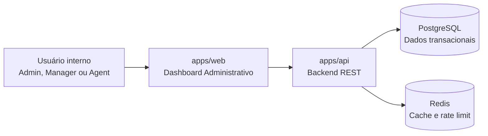
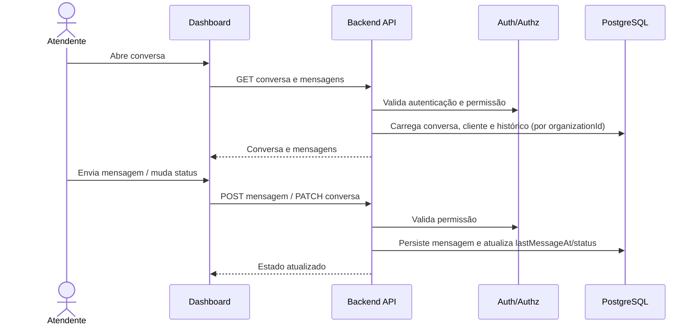
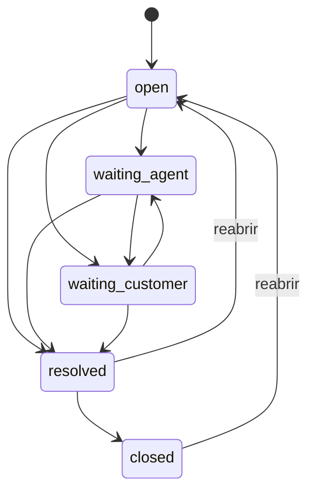

<!-- Projeto Desenvolvido na Data Science Academy -->

# Architecture - SaaS de Atendimento ao Cliente

## 1. Objetivo

Este documento descreve a arquitetura inicial do projeto, seus módulos, dependências e decisões técnicas.

Ele deve orientar o Claude Code durante criação de estrutura, implementação de módulos e revisão de mudanças.

## 2. Estilo Arquitetural

O projeto será organizado como monorepo full stack:

```text
apps/
  api/
  web/
packages/
  shared/
  api-contracts/
  testing/
docs/
  sdd/
```

O backend concentra regras de negócio, segurança, autorização, persistência, multi-tenancy e analytics.

## 2.1 Runtime e Containerização

A execução oficial do projeto é 100% Docker.

Todos os componentes da aplicação devem rodar em containers:

- `apps/api`;
- `apps/web`;
- PostgreSQL;
- Redis (cache e rate limit).

A máquina host não deve precisar de Node.js, PostgreSQL ou Redis instalados diretamente.

Toda documentação de setup, teste, migration e smoke test deve usar comandos baseados em Docker Compose.

## 2.2 Diagrama de Containers



## 3. Componentes

## 3.1 Frontend Admin

Aplicação web usada por admins, managers e agents.

Responsabilidades:

- autenticar usuário;
- listar conversas;
- visualizar histórico;
- enviar mensagens;
- atribuir e mudar status de conversas;
- visualizar métricas.

Não deve conter regras finais de autorização ou negócio.

## 3.2 API Backend

Serviço principal.

Responsabilidades:

- autenticação;
- autorização;
- multi-tenancy;
- contratos de API;
- conversas e mensagens;
- atribuição e status de conversas;
- métricas e analytics.

## 3.3 Banco Relacional

PostgreSQL para dados transacionais:

- organizações;
- usuários;
- papéis;
- clientes;
- conversas;
- mensagens.

## 3.4 Cache

Redis para:

- cache de leitura auxiliar;
- locks;
- rate limiting.

## 4. Fluxo Principal de Atendimento



## 5. Multi-Tenancy

Estratégia inicial:

- cada entidade de domínio possui `organizationId`;
- todas as queries devem filtrar por `organizationId`;
- permissões são avaliadas no contexto de uma organização;
- testes devem cobrir tentativa cross-tenant.

## 5.1 Estados de Conversa

A tabela normativa de transições está em `specs/conversation-history-spec.md` §4.0.1. Status muda apenas via `PATCH /conversations/:id`; mensagens não alteram status automaticamente.



## 6. Decisões Técnicas Iniciais

| Decisão | Escolha recomendada | Justificativa |
|---|---|---|
| Organização | Monorepo | Facilita projeto full stack e contratos compartilhados |
| API | REST | Mais simples para orientar contratos |
| Banco | PostgreSQL | Relacional, robusto e conhecido |
| Cache | Redis | Rate limit de login (security-spec §8) e cache auxiliar |
| Auth | Email/senha + Bearer JWT | Suficiente para MVP; sem cookie de sessão (ver api-contract.md §3) |
| ORM | Prisma | ADR-0003 (proposta) |
| Framework backend | TypeScript + Fastify + Zod | ADR-0004 (proposta) |
| Frontend | React + Vite + TypeScript | ADR-0005 (proposta) |

## 7. Módulos Backend

- `auth`;
- `organizations`;
- `users`;
- `roles`;
- `customers`;
- `conversations`;
- `messages`;
- `analytics`.

## 8. Princípios de Implementação

- Módulos devem ter responsabilidades claras.
- Integrações externas devem ficar em `infra` e atrás de interfaces.
- Regras de domínio não devem ficar no frontend.
- DTOs e validações devem seguir `api-contract.md`.

## 9. Riscos

| Risco | Mitigação |
|---|---|
| Vazamento cross-tenant | Filtro obrigatório por organizationId e testes |
| Escalada de privilégio | Matriz de permissões no backend e testes de autorização |
| Specs divergentes do código | Revisão contra critérios de aceite |

## 10. Como Usar Este Documento com IA

Prompt de execução:

```text
Leia docs/sdd/architecture.md e proponha a estrutura inicial de módulos backend. Para cada módulo, liste responsabilidades, dependências e testes esperados. Não implemente ainda.
```

## 11. Histórico de Mudanças

- **1.1 (2026-06-09):** diagrama de estados alinhado à tabela normativa de transições (`conversation-history-spec.md` §4.0.1); stack proposta adicionada à tabela de decisões (§6) referenciando ADRs 0003–0005.
- **1.0 (2026-06-03):** versão inicial.

**Versão:** 1.1  
**Status:** Proposta  
**Owner:** Equipe do projeto  
**Última atualização:** 2026-06-09  
**Substitui:** N/A
