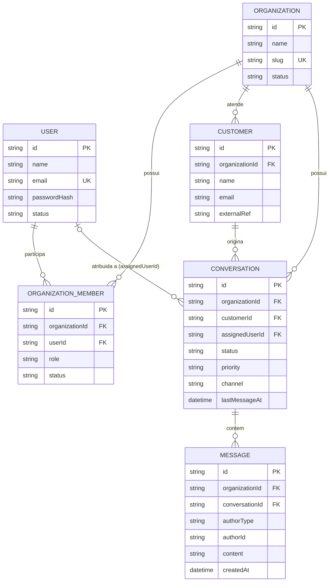

<!-- Projeto Desenvolvido na Data Science Academy -->

# Domain Model - SaaS de Atendimento ao Cliente

## 1. Objetivo

Este documento descreve as entidades, relacionamentos, estados e invariantes do domínio.

Ele deve ser consultado antes de qualquer mudança em banco, API, backend ou testes.

## 2. Entidades Principais

## 2.1 Organization

Representa uma empresa cliente do SaaS.

Campos principais:

- `id`;
- `name`;
- `slug`;
- `status`;
- `createdAt`;
- `updatedAt`.

Regras:

- toda entidade operacional pertence a uma organização;
- organização inativa não deve permitir novas operações;
- slug deve ser único.

## 2.2 User

Representa uma pessoa que acessa o sistema.

Campos principais:

- `id`;
- `name`;
- `email`;
- `passwordHash`;
- `status`;
- `createdAt`;
- `updatedAt`.

Regras:

- email deve ser único;
- senha nunca deve ser salva em texto puro;
- usuário pode pertencer a uma ou mais organizações no futuro.

## 2.3 OrganizationMember

Vínculo entre usuário e organização.

Campos principais:

- `id`;
- `organizationId`;
- `userId`;
- `role`;
- `status`;
- `createdAt`;
- `updatedAt`.

Regras:

- permissões são resolvidas a partir desse vínculo;
- usuário sem vínculo ativo não acessa dados da organização.

## 2.4 Customer

Cliente final atendido pela organização.

Campos principais:

- `id`;
- `organizationId`;
- `name`;
- `email`;
- `externalRef`;
- `metadata`;
- `createdAt`.

Regras:

- customer pertence a uma organização;
- `externalRef` é opcional para futuras integrações.

## 2.5 Conversation

Representa atendimento, ticket ou conversa.

Campos principais:

- `id`;
- `organizationId`;
- `customerId`;
- `assignedUserId`;
- `status`;
- `priority`;
- `channel`;
- `subject`;
- `lastMessageAt`;
- `createdAt`;
- `updatedAt`.

Status:

- `open`;
- `waiting_customer`;
- `waiting_agent`;
- `resolved`;
- `closed`.

Transições válidas: ver tabela normativa em `specs/conversation-history-spec.md` §4.0.1.

Regras:

- conversa deve sempre pertencer a uma organização;
- conversa fechada não recebe novas mensagens sem reabertura;
- `priority` é sempre `normal` no MVP (campo reservado, não exposto na API — como `externalRef` do customer);
- listagens devem ser paginadas.

## 2.6 Message

Mensagem dentro de uma conversa.

Campos principais:

- `id`;
- `organizationId`;
- `conversationId`;
- `authorType`;
- `authorId`;
- `content`;
- `metadata`;
- `createdAt`.

`authorType`:

- `customer`;
- `agent`;
- `system`.

Regras:

- mensagem não deve ser alterada silenciosamente;
- mensagens devem ser ordenadas por criação;
- mensagens de `system` registram eventos automáticos (ex.: mudança de status).

## 3. Relacionamentos

- Organization 1:N OrganizationMember
- User 1:N OrganizationMember
- Organization 1:N Customer
- Organization 1:N Conversation
- Customer 1:N Conversation
- Conversation 1:N Message



## 4. Invariantes

- Toda query de domínio deve considerar `organizationId`.
- Mensagens preservam autoria e data e não são alteradas silenciosamente.
- Conversa fechada não recebe novas mensagens sem reabertura.
- Permissões são avaliadas no backend.

## 5. Como Usar Este Documento com IA

Prompt de execução:

```text
Leia docs/sdd/domain-model.md e proponha o schema inicial do banco, incluindo relacionamentos, índices e restrições. Não implemente antes de comparar com database-schema.md.
```

## 6. Histórico de Mudanças

- **1.2 (2026-06-09):** adicionado diagrama ER Mermaid em §3.
- **1.1 (2026-06-09):** `priority` marcado como campo reservado; referência à tabela de transições de status.
- **1.0 (2026-06-03):** versão inicial.

**Versão:** 1.2  
**Status:** Proposta  
**Owner:** Equipe do projeto  
**Última atualização:** 2026-06-09  
**Substitui:** N/A
